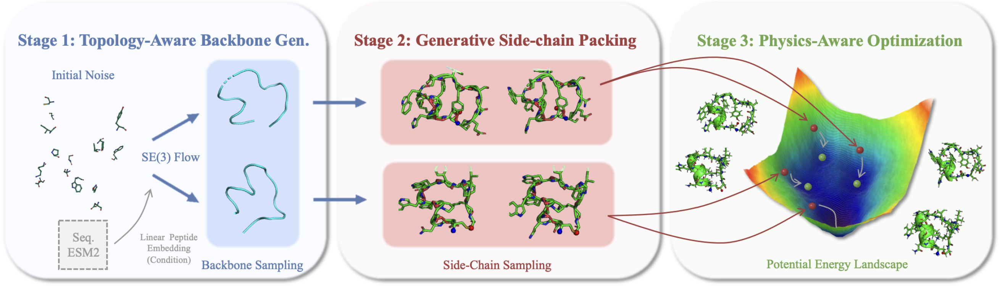
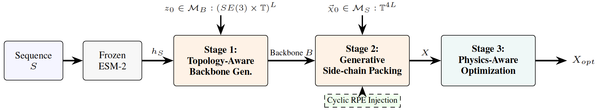

# MuCO: Generative Peptide Cyclization Empowered by Multi-stage Conformation Optimization

> **Accepted by ICML 2026**

MuCO is a generative framework for cyclic peptide conformation modeling via **multi-stage conformation optimization**. Given a linear peptide, MuCO decomposes peptide cyclization into three coordinated stages: topology-aware backbone generation, generative side-chain packing, and physics-aware all-atom refinement.

This repository contains the official implementation of **MuCO**, accompanying our ICML 2026 paper on generative peptide cyclization.

## Overview

Cyclic peptides are important molecular scaffolds for therapeutic discovery because they often exhibit improved stability, proteolytic resistance, membrane permeability, and target-binding specificity relative to linear peptides. Their conformational landscape is, however, highly constrained and multi-modal, which makes direct deterministic prediction inadequate for capturing diverse low-energy ring-closed structures.

MuCO addresses this challenge by factorizing cyclic peptide generation into a coarse-to-fine pipeline:

1. **Topology-Aware Backbone Generation** with sequence-conditioned SE(3) flow matching.
2. **Generative Side-chain Packing** with equivariant conditional flow modeling.
3. **Physics-Aware Optimization** with force-field-based refinement and cyclization validation.

This decomposition enables efficient parallel exploration of candidate conformations while preserving physical plausibility and structural diversity.

## News

- **[2026-05] MuCO has been accepted to ICML 2026.**
- **[2026-01] arXiv preprint prepared.** Replace the placeholder arXiv identifier below once the public preprint is available.

## Paper

**MuCO: Generative Peptide Cyclization Empowered by Multi-stage Conformation Optimization**  
Yitian Wang, Fanmeng Wang, Angxiao Yue, Wentao Guo, Yaning Cui, Hongteng Xu

- **Conference:** International Conference on Machine Learning (ICML), 2026
- **Preprint:** `https://arxiv.org/abs/2602.11189`

## Abstract

Modeling peptide cyclization is critical for the virtual screening of candidate peptides with desirable physical and pharmaceutical properties. This task is challenging because cyclic peptides often exhibit diverse ring-shaped conformations that are not well captured by deterministic prediction models derived from linear peptide folding. MuCO models the distribution of cyclic peptide conformations conditioned on the corresponding linear peptide through a three-stage pipeline: topology-aware backbone design, generative side-chain packing, and physics-aware all-atom optimization. This coarse-to-fine formulation supports efficient parallel sampling, rapid exploration of diverse low-energy conformations, and improved physical realism. Experiments on the large-scale CPSea dataset show that MuCO outperforms strong baselines in physical stability, structural diversity, secondary-structure recovery, and computational efficiency.

## Framework Figure




*Figure 1. Illustration of the 3-stage MuCO scheme: topology-aware backbone generation, generative side-chain packing, and physics-aware optimization.*



*Figure 2. Framework overview of MuCO with decoupled backbone generation, side-chain packing, and energy-guided refinement.*

## Key Highlights

- **Multi-stage generation:** decouples cyclic peptide modeling into backbone generation, side-chain packing, and physics-guided refinement.
- **Improved physical stability:** achieves substantially lower potential energy than deterministic folding baselines.
- **Higher conformational diversity:** alleviates mode collapse and better recovers cyclization-mode and secondary-structure distributions.
- **Efficient hierarchical sampling:** supports parallel `K x M` exploration over backbone and side-chain states.
- **Practical cyclization support:** includes head-to-tail, disulfide, and Lys-Asp/Glu isopeptide cyclization modes.

## Main Results

On the curated CPSea benchmarks, MuCO demonstrates strong empirical performance in:

- **Physical stability** measured by CHARMM36 potential energy.
- **Structural diversity** measured by entropy over conformational clusters and cyclization modes.
- **Secondary-structure recovery** relative to reference cyclic conformations.
- **Inference efficiency** through parallel hierarchical sampling.

Representative observations reported in the paper include:

- MuCO achieves the **lowest mean potential energy** among compared methods in the main benchmark.
- MuCO improves diversity relative to AF2-based cyclic peptide baselines that exhibit severe mode collapse.
- MuCO reaches **41 ms amortized latency per sample** under parallel sampling, compared with multi-second latency for folding-based baselines.

## Repository Structure

```text
MuCO-ICML2026/
├── backbone_train.py
├── backbone_sample.py
├── sidechain_train.py
├── sidechain_sample.py
├── muco_infer.py
├── config/
├── data/
├── model/
├── openfold/
├── relaxer/
├── runner/
├── saved_model/
├── utils/
├── assets/
│   └── figures/
├── environment.yml
└── README.md
```

## Installation

### Prerequisites

- Python 3.9+
- CUDA 11.x or later for GPU acceleration
- Conda recommended for environment management

### Environment Setup

```bash
conda env create -f environment.yml
conda activate muco
```

`environment.yml` contains the backend runtime dependencies used by both local execution and `Dockerfile.api`, including PyTorch CUDA 11.8, FastAPI, OpenMM, PyMOL, and MuCO model dependencies.

### Model Weights

Pretrained MuCO checkpoints are not stored in this repository. Download the weights from the Google Drive link in `params/link.md` and place them under `params/` before running inference or the API server:

```text
params/foldflow.pth
params/flowpacker.pth
```

The `params/` directory is ignored by Git except for `params/link.md`, so local checkpoint files will not be committed accidentally.

## Method Pipeline

### Stage 1: Backbone Generation

The backbone generator builds cyclic peptide backbones with sequence-conditioned **SE(3) flow matching**, using ESM2 representations and geometry-aware transformers.

```bash
python backbone_train.py
```

Sampling example:

```bash
python backbone_sample.py \
    --config_timestamp {timestamp} \
    --ckpt_epoch 100 \
    --output ./data/inference/pdb/coarse \
    --device 0 \
    --batch_size 1024 \
    --split CPBind
```

### Stage 2: Side-chain Packing

The side-chain module predicts torsional configurations conditioned on the generated backbone using **EquiformerV2** within a conditional normalizing-flow framework.

```bash
python sidechain_train.py config/sidechain_train.yaml \
    --devices 4 \
    --strategy auto \
    --precision 32-true
```

Resume training:

```bash
python sidechain_train.py config/sidechain_train.yaml --resume
```

Sampling example:

```bash
python sidechain_sample.py config/sidechain_sample.yaml output_name \
    --seed 42 \
    --save_traj False
```

### Stage 3: Physics-Aware Optimization

The final stage applies OpenMM-based refinement to improve local geometry, reduce steric clashes, and validate chemically valid ring closure.

Supported cyclization modes:

- **Head-to-tail** cyclization
- **Cys-to-Cys** disulfide cyclization
- **Lys-Asp/Glu** isopeptide cyclization

Single-structure relaxation:

```bash
python relaxer/auto.py input.pdb output.pdb
```

Batch relaxation:

```bash
python relaxer/relax.py
```

## Quick Start

For a standard generation workflow, run the three stages sequentially:

1. Generate cyclic peptide backbones.
2. Pack side chains on sampled backbones.
3. Refine generated conformations with the relaxation module.

If you maintain a project-specific inference wrapper, start from `muco_infer.py` and the scripts under `runner/`.

### Docker And API Deployment

Backend API deployment is documented in `API_DEPLOYMENT.md`. API job and log directories are server-managed through `JOB_ROOT` and `LOG_ROOT`; clients do not submit filesystem paths. The command-line wrapper still supports explicit local output and log directories for operator workflows:

```bash
python muco_infer.py input.json \
    --output ./runs/cli/job-001 \
    --log_dir ./runs/cli_logs/job-001 \
    --K 1 \
    --M 1
```

## Evaluation

The paper evaluates MuCO using the following criteria:

- **Success Rate:** percentage of conformations satisfying cyclization geometry constraints.
- **Physical Stability:** mean potential energy computed with CHARMM36.
- **Diversity:** entropy over cyclization modes and secondary-structure clusters.
- **Secondary-Structure Recovery:** agreement with reference conformational distributions.

Benchmarks are constructed on filtered subsets derived from **CPSea**, including `CP-Bind`, `CP-Trans`, `CP-Core`, and `CPSea-PDB`.

## Citation

If you find this repository useful, please cite our paper:

```bibtex
@inproceedings{wang2026muco,
  title     = {MuCO: Generative Peptide Cyclization Empowered by Multi-stage Conformation Optimization},
  author    = {Wang, Yitian and Wang, Fanmeng and Yue, Angxiao and Guo, Wentao and Cui, Yaning and Xu, Hongteng},
  booktitle = {Proceedings of the International Conference on Machine Learning},
  year      = {2026},
  note      = {Accepted by ICML 2026},
  url       = {https://arxiv.org/abs/2602.11189}
}
```

After the arXiv page is public, replace the placeholder URL with the official identifier.

## Contact

For questions about the paper or repository, please contact:

- **Hongteng Xu**: `hongtengxu@ruc.edu.cn`

If you would like, you can also add maintainer contacts for code-level issues in this section.

## Acknowledgments

MuCO builds upon several influential open-source and scientific software projects, including:

- [FoldFlow](https://github.com/DreamFold/FoldFlow)
- [EquiformerV2](https://github.com/atomicarchitects/equiformer_v2)
- [OpenFold](https://github.com/aqlaboratory/openfold)
- [ESM](https://github.com/facebookresearch/esm)
- [OpenMM](https://openmm.org/)

## License

This repository is intended for academic research use. See `LICENSE` for the current licensing terms.
